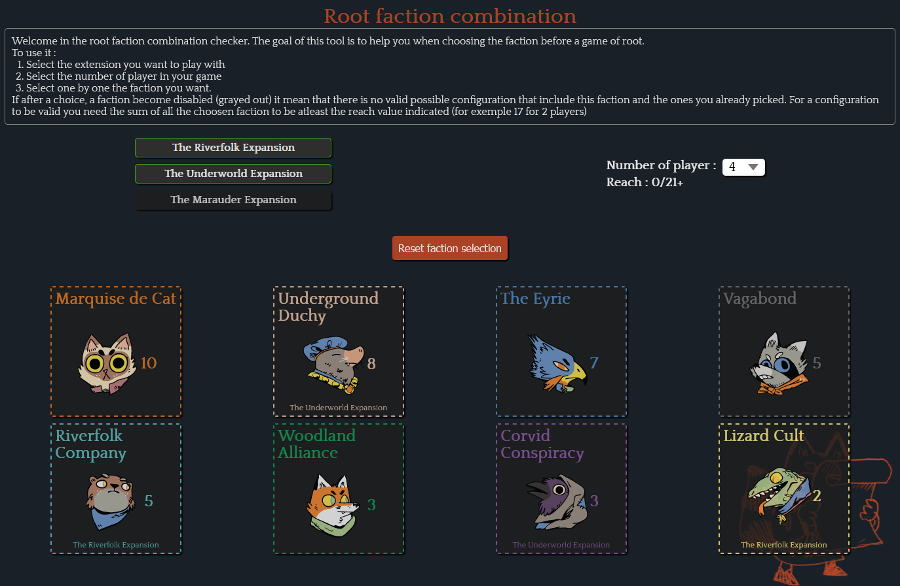
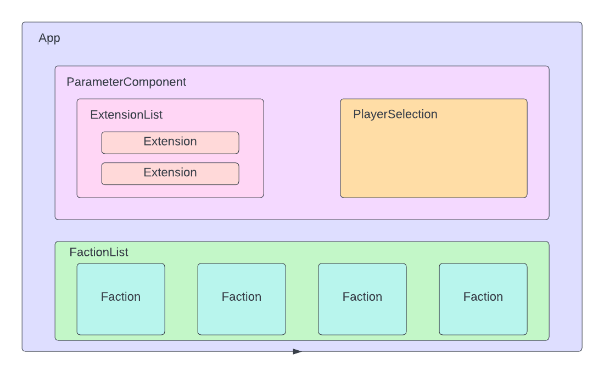

# Root faction combination


A react web application to help player find a valid faction configuration for the board game root.

<p align="center">
    <a href="https://aelly.github.io/root-faction-combination/" target="_blank">
        
    </a>
</p>

## What is it and how does it work ?


Root is an asymmetric board game in which multiple players are fighting over the control of the forest. At the beggining of the game, each player choose a faction. Every faction have a different gameplay, for exemple one of them will have a lots of soldier on the board and fight to control their position while another will be focused on converting enemy soldier and buidling to their cult and will win position without fighting.

To help player create valid game configuration (balance between faction that have a lots of soldier and others); the game developper have added a litle helper to their rules. Every faction is assigned a reach value, to make a viable game the total reach value of the choosen faction need to equal or exceeds the amount for the player count.

The goal of this application is to have a better vizualisation of this combination. For exemple in the image above, two factions have already be choosen : _The Eyrie_ (reach 7) and the _Corvid Conspiracy_ (reach 3). The total current reach is 10 and we need 8 more for the setup to be viable so you can't choose neither the _Vagabond_ (reach 5) or the _Woodlance Alliance_ (reach 3), hence why they are disabled.

## Contribute

This app was created to learn react (and is in fact my first time writting an app from scratch), if you want to correct a mistake or add a functionnality (like a future extension) feel free to do so by opening an issue or creating a pull request.

### Installation

This application require [node](https://nodejs.org/en/), install it first if you havn't already done.

1. Clone the repo

```shell
git clone https://github.com/Aelly/root-faction-combination.git
```

2. Install dependecies

```shell
npm install
```

I was concerned with the 6 hight severity vulnerabilities but from what I understood the best things to do is ignore them ([source](https://overreacted.io/npm-audit-broken-by-design/)). When I tried to fix them, it just rolled me back to an old typescript version and I had even more vulnerabilities anyway. If anyone know more about it please explain it to me !

3. Start the application
```shell
npm run start
``` 

### Architecture

#### Data

All the data for the application are store in two json files in the src/json folder : extension.json and faction.json.

The extension.json store the list of extension for the game. An extension is simply an id and a name. The base game is stored as a extension with an id 0 to simplify the data structure. This type is used in the application as an IExtension (defined in src/types/IFaction.tsx)

```json
{
    "id": 1,
    "extensionName": "The Riverfolk Expansion"
}
```

The main data type is stored in faction.json, it's used as an IFaction in the application and contain everything needed to display a faction and compute the application logic. _requiredFaction_ is used to defined a faction that need to be the game for another one to be available. For now it only applyed to the 2nd vagabond that obviously can't be picked if the first vagabond is still available.

```json
{
    "id": 7,
    "factionName": "2nd Vagabond",
    "reachValue": 2,
    "factionColor": "#626161",
    "icon": "Vagabond.png",
    "extensionId": 1,
    "requiredFactionId": 3
}
```

#### Components



The application is divided in multiple component :

- src/App.tsx : The root of the application, contain the explanation at the top, the two buttons and all the other component. The three state of the application (faction selected, extension selected and number of player) are stored here.
- src/components/ParameterComponent.tsx : Container component to wrap the two parametrable parameter of a game : the number of player and the extension owned. The management of the corresponding state is handled here and only the current state and a hook to change it is passed to the component below.
- src/components/parameters/player/PlayerSelectionComponent.tsx : Simple component with the select to choose the number of player in the game.
- src/components/parameters/extension/ExtensionListComponent.tsx : Simple component the handle the mapping from an IExtension to the ExtensionComponent.
- src/components/parameters/extension/ExtensionComponent.tsx : Display an extension as a selectable card.
- src/components/faction/factionListComponent.tsx: Handle the selection of a faction and the mapping from a IFaction to a FactionComponent with the valid property depending of the state of the combination.
- src/components/faction/factionComponent.tsx: Simple component to display a faction as a selectionnable (or disabled) card.

#### Logic

All the logic used to know if a faction is pickable, a configuration is valid, create a random game,... is done in the src/utils/CombinationUtil.ts files. All the function in there are pure function and being tested in the src/utils/test/CombinationUtils.test.ts.

## Licence

Distributed under the  GPL-3.0 license. See LICENSE for more information.
