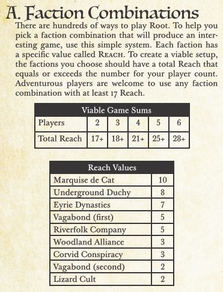

# Root faction combination

A react web application to help player find a valid faction configuration for the board game root.

    

## What is it and how does it work ?

Root is an asymmetric board game in which multiple players are fighting over the control of the forest. At the beggining of the game, each player choose a faction. Every faction have a different gameplay, for exemple one of them will have a lots of soldier on the board and fight to control their position while another will be focused on converting enemy soldier and buidling to their cult and will win position without fighting.

To help player create valid game configuration (balance between faction that have a lots of soldier and others); the game developper have added a litle helper to their rules. Every faction is assigned a reach value, to make a viable game the total reach value of the choosen faction need to equal or exceeds the amount for the player count.

The goal of this application is to have a better vizualisation of this combination. For exemple in the image above, two factions have already be choosen : _The Eyrie_ (reach 7) and the _Corvid Conspiracy_ (reach 3). The total current reach is 10 and we need 8 more for the setup to be viable so you can't choose neither the _Vagabond_ (reach 5) or the _Woodlance Alliance_ (reach 3), hence why they are disabled.

## Contribute

This app was created to learn react (and is in fact my first time writting an app from scratch), if you want to correct a mistake or add a functionnality (like a future extension).

### Installation

### Architecture

## Licence

Distributed under the  GPL-3.0 license. See LICENSE for more information.
