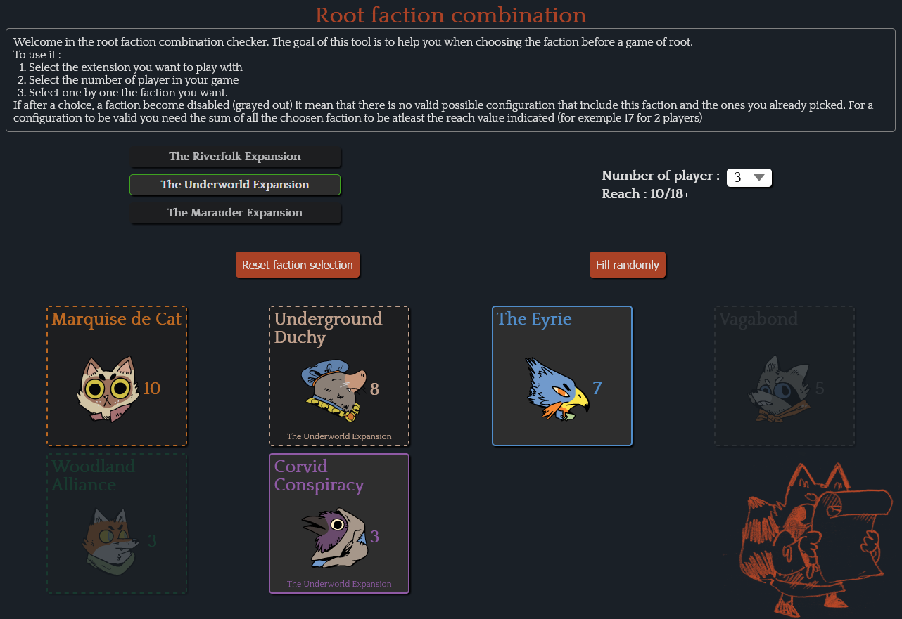

# Root faction combination

A react web application to help player find a valid faction configuration for the asymmetric board game root.

[Try it](https://aelly.github.io/root-faction-combination/)

